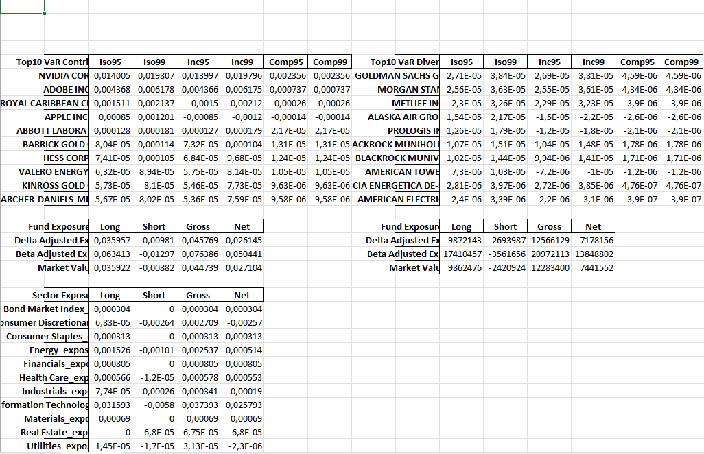
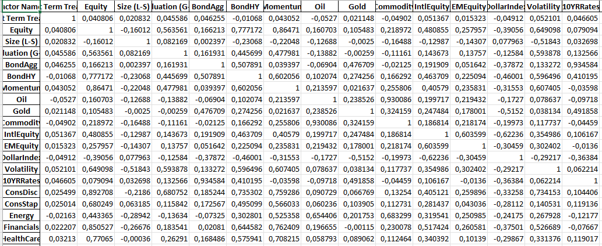
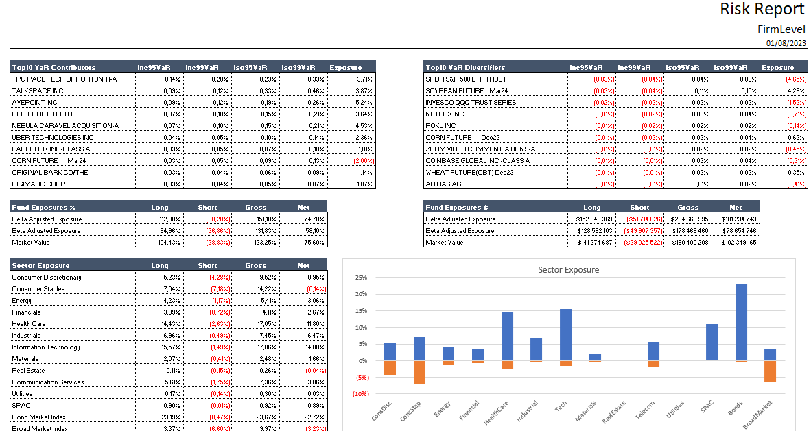
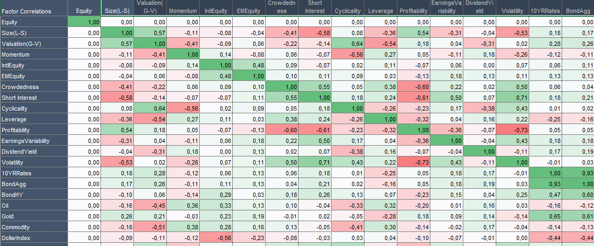

# var_dashboard

## Problem statement

Client has a script that generates report elements (a lot of smaller tables). And wants these tables to be placed in Excel using `xlsxwriter`.
Tables should have specific formatting and should also have charts based on these tables.  
This output:
  

should be turned into this:



We do not touch the data generation part, but we need to create export module. Position of tables should be dynamically set based on the available data as well as chart sources should depend on the size and position of the charts in the excel file.

In total, there are 10 worksheets, that have to 

## Solution
Each sheet is generated using a separate sheet generation function. Which is responsible to take the data and place elements according to the sheet logic.

3 classes were created to support this need:
* `ReportItem`. Base class for all elements placed on a worksheet. Responsible to calculate position of the Item based on the element it should snap to with given snap type (right or down) and the snap margin.
* `ReportTable`. Inherits from `ReportItem` and contains information about the table that should be placed and the format that should be applied to it.
* `WorksheetTable`. Inherits from `ReportItem`. Responsible for holding information the chart (which table should it take the data from, which columns should assigned to axes, which formats should be applied to the chart, axes etc.)

### ReportItem
Can either be instantiated with the intial position (a tuple with x and y coordinates) or can be instantiated with the snapping element. For example, we have a `Table A` and we want our `Table B` to snap to it to the right of the `Table B`, taking a margin of 2 columns.

To support this this item has a property `position`. `Position` is cached to speed up calculations when dealing with multiple objects on the sheet.

```python
@dataclass
class ReportItem:
    '''class is responsible for calculating position of the element'''
    initial_position: Optional[Tuple[int, int]] = None
    snap_element: Optional[Any] = None
    snap_mode: Optional[SnapType] = None
    margin: Optional[int] = 2

    @cached_property
    def position(self) -> Tuple[int, int]:
        if self.initial_position:
            return self.initial_position

        if self.snap_element and self.snap_mode:
            parent_position = self.snap_element.position
            shifter = OPERATION_MAP.get(self.snap_mode)
            return shifter(parent_position, self.snap_element, self.margin)

        raise NotImplementedError(
            'Could not find position of the element. Neither'
            ' initial position nor linked element are set.'
        )
```

### ReportTable
Contains a Pandas dataframe to be put in position as well as name for the `excel range object`. It is independent from actual length of the column and allows creation of column wise formulas, especially when dealing with charts. 


Since data is also a part of it, we can always calculate what is the range, that this table takes by using the position and data dimentions.
```python
@dataclass
class ReportTable(ReportItem):
    '''
    class is responsible for storing table information
    calculates table start position and its range
    '''
    data: pd.DataFrame = None  # type: ignore
    values_format: Any = 'currency'
    date_format: Any = None
    table_name: str = 'some table'

    @property
    def range(self) -> Tuple[Tuple[int, int]]:
        '''
        returns range of the table
        coordinates x=columns, y=rows
        Returns
            tuple containing x,y of top-left and x,y of bottom-right
        '''

        return (
            # top left
            tuple(x for x in self.position),  # type: ignore
            # bottom right
            tuple(x+y for x, y in zip(self.position, self.data.shape[::-1]))
        )
```

### WorksheetChart
Contains information required to set up a chart, including formatting elements (stacked, axis format), setup information (which table should it take information from, what are the column names, etc.) as well as snapping and size options (which element to stap to, how many rows should it take, page_layout).

Page layout will be described below, but basically it is needed to calculate the siwe of the chart in pixels. For example, if the start snaps to the right to a table, it should have width from the starting position to the right edge of the report. Or if the chart spnaps down to a table, it will start on the left and stretch over to the right part of the worksheet.

```python
@dataclass
class WorksheetChart(ReportItem):
    table_name: Optional[str] = 'some_table'
    columns: Optional[List[str]] = None
    categories_name: str = 'Some table'
    page_layout: Optional[Any] = None
    initial_rows: int = 15
    title: str = None  # type: ignore
    stacked: bool = True
    axis_format: str = 'float'

    @property
    def size(self) -> Tuple[float, float]:
        '''calculates size of the chart depending'''

        width = self.page_layout.pixels_to_right_edge(self.position[0])

        # the image should take the whole width
        if (not self.snap_mode) or (self.snap_mode == SnapType.DOWN):
            height = self.page_layout.pixels_to_bottom(self.initial_rows)
            return (width, height)

        # otherwise we need to calculate width and
        # heigh depending on the snap item
        if not self.snap_element:
            height = 10
            return (width, height)

        height = self.page_layout.pixels_to_bottom(
            len(self.snap_element.data) + 1)
        return (width, height)
```

### Layout
Is a class that defines how many columns a particular page has and what are the widths for every one of them, depending on their type. 4 types of columns are supported:
* SIDE_COLUMNS. Usually column names on the right and left of the data
* CATEGORY_COLUMNS. Wider columns that contain text
* NUMERIC_COLUMNS. Narrow columns for storing numeric data
* MIDDLE_COLUMNS. Separators usedbetween columns of the report.


### Structure of a worksheet generating function
A typical worksheet generating function would have the following structure:
```python
def generate_var_report_sheet(writer, data: List[Dict]) -> None:
    '''generates var report'''

    layout = NarrowDashboardLayout()
    styles, worksheet = set_up_workbook(writer, sheet_name=SHEET_NAME)
    insert_header(worksheet, styles, layout)

    report_tables = []
    report_charts = []

    first_row_tables = rgo.init_report_group(
        styles=styles,
        table_names=['var_top10', 'var_bottom10'],
        tables=[
            data[0].get('var_top10'),
            data[0].get('var_bottom10')
        ],  # type: ignore
        inner_snap_mode=SnapType.RIGHT,
        inner_margin=2,
        initial_position=(1, 5),  # type: ignore
    )

    report_tables.extend(first_row_tables)

    ancor_item = report_tables[0]
    next_row_margin = 2
    for table_name, table_data in data[1].items():
        row_table, row_chart = rgo.init_table_with_chart(
            styles=styles,
            layout=layout,
            global_snap_to=ancor_item,
            table_name=table_name,
            table_data=table_data,
            chart_columns=['Iso95', 'Iso99'],
            next_row_margin=next_row_margin,
        )
        next_row_margin = 18
        ancor_item = row_table
        report_tables.append(row_table)
        report_charts.append(row_chart)

    for table in report_tables:
        eu.insert_table(worksheet, table)

    for report_chart in report_charts:
        eu.insert_chart(writer, worksheet, report_chart, stacked=False)

    format_dashboard_worksheet(worksheet, layout)
```

And would realise the following pipeline:
1. initiate the worksheet: insert header, initialize styles, set up layout.
2. Instantiate report tables
3. Instantiate charts
4. Format worksheet: set zoom, hide gridlines, set printable area, set rows that will be repeated on every printed area, set column widths according to the specific layout.